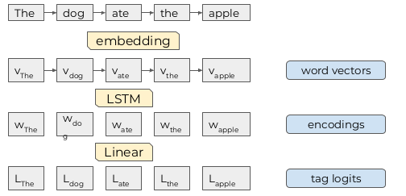

# an LSTM for part-of-speech tagging

# The Problem
Given a training dataset that looks like
```
The###DET dog###NN ate###V the###DET apple###NN
Everybody###NN read###V that###DET book###NN

```
learn to predict part-of-speech tags

# With a Few Enhancements to Make Things More Realistic
1、read data from files

2、check performance on a separate validation dataset

3、use tqdm to track training progress

4、implement early stopping based on validation loss

5、track accuracy as we're training

# Start With a Simple Baseline Model
1、compute a vector embedding for each word

2、feed the sequence of embeddings into an LSTM

3、feed the hidden states into a feed-forward layer to produce a
sequence of logits

